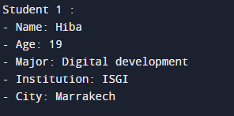

## Description
This Java program showcases a Student class managing key student details like name, age, major, institution, and city. It includes a default constructor (with custom initialization) and a method to present the student's information.
## Output

